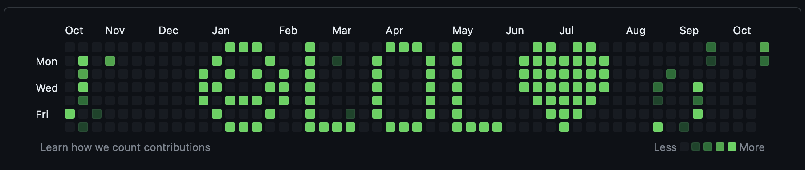

# Paint Your Github Profile Contributions Calendar

This tool displays a message on your Github contributions calendar. 

### Example
message: `❤LOL❤`, intensity: 10

### What is a Github contributions calendar?
The contributions calendar/graph on a Github profile is a heatmap that shows the daily commit history (and other github contributions) of a user. Displayed in a calendar grid format, it is a visualization of a user's activity on Github, with brighter squares indicating higher activity on a particular day. It's meant to be a record of a user's contributions over the past year.  

### How do you paint it?
The trick is to backdate commits. Commits light up the day of their commit date, which can be adjusted using the `GIT_COMMITTER_DATE` environment variable. This tool maps the "pixels" of the message to the corresponding days on the calendar grid. Dummy commits are backdated and pushed to a dummy repo, and Github renders the message on the contributions calendar accordingly.

### How do you unpaint it?
Delete the `dummy-repo-github-graphiti` repository. As soon as it is deleted, the dummy commits are removed from the calendar. 

### Does it remove my real contributions?
No. The commits are made to, and removed from, a dummy repository only. They paint over your real contributions without removing them.

### Usage
0. Prerequisites: Your github personal access token is set in the `$GH_TOKEN` environment variable. You can create a token [here](https://docs.github.com/en/authentication/keeping-your-account-and-data-secure/managing-your-personal-access-tokens#creating-a-personal-access-token-classic). You also have installed `go`.
1. Clone this repository. `cd` into the repo.
2. Edit the `message` field in `config.toml` to set your desired message.
3. Edit the `intensity` field in `config.toml` to set the intensity of painted days. Choose a value higher than your highest daily commit count to make the message more visible.
3. Run `go run .`. Check your contributions calendar to see the message.

### Supported Characters
The following characters are supported: L U D I R E H A K ❤ O G P S ! . 

Also, an empty space.

If you would like to support a new character, please add it to `characters.go` and open a PR, or ask me nicely.

### Inspiration
Playing with the BBC micro:bit v2, and making designs on its 5 x 5 LED grid.
